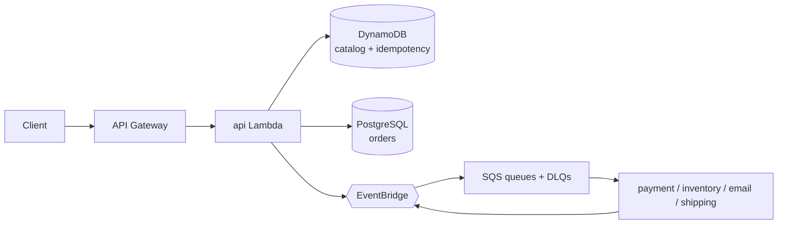

# Cloud Commerce & Inventory API

An event-driven commerce and inventory backend on AWS, built to demonstrate
production-grade engineering judgement — not a tutorial CRUD app. TypeScript on
Lambda, DynamoDB for the catalog, PostgreSQL for orders, EventBridge + SQS for
asynchronous order processing, Cognito for auth, and CloudWatch for
observability, all provisioned with AWS CDK.

> **Status:** actively being built phase by phase. See [Build Status](#build-status).

---

## Overview

Placing an order kicks off several independent side effects — reserve
inventory, charge payment, send a confirmation, request a shipment. Each has its
own latency and failure profile, so the HTTP request that creates the order does
the minimum synchronously (validate → reserve inventory → persist → publish
`OrderCreated`) and everything else happens in workers behind durable queues
with dead-letter queues, bounded retries, and idempotency.

The codebase is a pnpm monorepo with a strict layering rule: **thin handlers →
controllers → application services → pure domain**, where services depend on
ports (`OrderRepository`, `EventPublisher`, `PaymentProvider`), never on the AWS
SDK directly. That makes the business logic unit-testable with in-memory doubles
and keeps AWS at the edges.

## Architecture

Full detail in [`docs/architecture.md`](docs/architecture.md). In brief:



- **Layering:** `apps/api` (handlers, middleware, routes, controllers) and
  `apps/workers` sit on top of `packages/domain` (entities + application
  services + ports). Adapters (`packages/database`, `packages/events`,
  `packages/integrations`, `packages/auth`) implement the ports.
- **One API Lambda** with a dependency-free internal router
  ([ADR 005](docs/adr/005-single-api-lambda.md)).
- **CDK**, one stack per concern: `Storage`, `Database`, `Messaging`, `Api`,
  `Monitoring`.

## Features

| Area                                                               | Status     |
| ------------------------------------------------------------------ | ---------- |
| Health / readiness endpoints                                       | ✅ Phase 1 |
| Structured logging + correlation IDs end to end                    | ✅ Phase 1 |
| CloudWatch EMF metrics + RFC7807 error responses                   | ✅ Phase 1 |
| Product catalog CRUD, filtering, pagination, inventory reservation | ✅ Phase 2 |
| Orders: customers / orders / items / payments / shipments          | ✅ Phase 3 |
| Async processing: EventBridge, SQS workers, DLQs, idempotency      | ✅ Phase 4 |
| Cognito auth, RBAC, least-privilege IAM, Secrets Manager           | 🔜 Phase 5 |
| Alarms, dashboards, deliberate failure scenario + runbook          | 🔜 Phase 6 |
| OpenAPI spec, E2E/perf tests, storefront UI                        | 🔜 Phase 7 |

## Technology Stack

- **Language / runtime:** TypeScript, Node 22 on AWS Lambda (ARM64)
- **IaC:** AWS CDK (TypeScript)
- **Validation:** Zod
- **Logging:** Pino (structured JSON) + AsyncLocalStorage correlation context
- **AWS SDK:** v3
- **Auth:** Cognito → JWT → Lambda-side verification (`aws-jwt-verify`)
- **Testing:** Vitest (unit / contract / integration / e2e)
- **Package manager:** pnpm workspaces

## AWS Services

| Service                | Use                                                             |
| ---------------------- | --------------------------------------------------------------- |
| API Gateway (HTTP API) | Public HTTP surface, stage throttling, access logs              |
| Lambda                 | `api` (internal router) + one worker per queue                  |
| DynamoDB               | Product catalog + inventory counters; idempotency records (TTL) |
| RDS (PostgreSQL)       | Transactional order data                                        |
| EventBridge            | Domain-event bus + 30-day archive for replay                    |
| SQS                    | Per-worker queues, each with a DLQ                              |
| Cognito                | User pool, JWT issuance, RBAC groups                            |
| Secrets Manager        | All runtime credentials, referenced by ARN                      |
| S3                     | Product images, generated reports, log archives                 |
| CloudWatch             | Structured logs, EMF metrics, alarms, dashboard                 |
| X-Ray                  | Active tracing on every Lambda                                  |

## API Documentation

See [`docs/api.md`](docs/api.md). Machine-readable OpenAPI spec lands in Phase 7.

Currently live:

```
GET /health         → { status: "ok", version, stage, uptimeSeconds }
GET /health/ready    → { status, checks: { catalogTable, database, ... } }
```

## Database Design

See [`docs/database.md`](docs/database.md).

## DynamoDB Access Patterns

Designed before any table code is written (CLAUDE.md §4):

1. Get product by id
2. List products by category (paginated)
3. Find product by SKU
4. List active products (paginated)
5. Reserve inventory (conditional update `available >= :qty`)

`Scan` is banned on the request path and enforced by ESLint.

## Event-Driven Architecture

Domain events (`OrderCreated`, `InventoryReserved`, `PaymentCompleted`,
`PaymentFailed`, `ShipmentDispatched`, …) are published to EventBridge and routed
to SQS-backed workers. Each queue has a visibility timeout, bounded retries, and
a DLQ with a depth alarm. Workers are idempotent because SQS is at-least-once.
See [ADR 003](docs/adr/003-event-driven-processing.md).

## Authentication & Authorization

Cognito issues JWTs; the API verifies them Lambda-side and derives permissions
from Cognito group membership: `CUSTOMER`, `OPERATIONS`, `ADMIN`. Handlers assert
on a **permission** (`catalog:write`, `order:read:any`, …), not a role name.
Full wiring in Phase 5. See [ADR 005](docs/adr/005-single-api-lambda.md) for the
IAM-scope note.

## Reliability

- `Idempotency-Key` on retryable mutations, stored in DynamoDB
  ([ADR 004](docs/adr/004-idempotency.md)).
- Every queue: bounded retries → DLQ → alarm. DLQ inspection/retry endpoints are
  in scope, not "future work".
- Inventory reservation uses optimistic concurrency (conditional writes) to
  prevent overselling the last unit.
- External providers are interfaces with `Mock*` implementations that can
  simulate decline, rate-limit, 5xx, and timeout — no call is assumed to succeed.

## Observability

- 100% structured JSON logs (Pino), never `console.log`.
- A correlation id is generated at the API boundary and threaded through every
  log line, event, and queue message.
- CloudWatch metrics via EMF: `OrdersCreated`, `OrdersFailed`, `PaymentFailures`,
  `InventoryReservationFailures`, `LambdaErrors`, `LambdaDuration`, `QueueDepth`,
  `DLQMessages`.
- Alarms + dashboard + a deliberately triggerable failure scenario with a
  documented runbook: [`docs/troubleshooting.md`](docs/troubleshooting.md)
  (Phase 6).

## Security

- No secret is ever hardcoded — Secrets Manager, referenced by ARN.
- Each Lambda's IAM role is scoped to the exact tables / queues / secrets it
  uses; no broad managed policies.
- All input validated with Zod at the boundary before business logic.
- SQL always parameterised. CORS, rate limiting, and audit logging are explicit.
- CI runs dependency audit, CodeQL, and secret scanning.

## Testing

```bash
pnpm test              # everything
pnpm test:unit         # application services + domain (in-memory doubles)
pnpm test:contract     # external provider interface contracts
pnpm test:integration  # Lambda ↔ DynamoDB / PostgreSQL (local containers)
pnpm test:e2e          # full order flow through the handler
```

Every phase ships with at least unit coverage for its new services before it is
marked done.

## Local Development

```bash
pnpm install
cp .env.example .env

# optional: local datastores
docker run -p 8000:8000 amazon/dynamodb-local
docker run -p 5432:5432 -e POSTGRES_USER=commerce -e POSTGRES_PASSWORD=commerce -e POSTGRES_DB=commerce postgres:16-alpine

pnpm build
pnpm --filter @cloud-commerce/api dev     # http://localhost:4000
curl localhost:4000/health
```

## Deployment

See [`docs/deployment.md`](docs/deployment.md).

```bash
ENV=staging pnpm --filter @cloud-commerce/infrastructure deploy
```

## CI/CD

GitHub Actions: `test.yml` (lint → format → typecheck → unit/contract/e2e +
integration job), `security.yml` (audit / CodeQL / secret scan), `deploy.yml`
(build → staging → smoke tests; production is a gated manual dispatch, AWS auth
via OIDC).

## Troubleshooting

[`docs/troubleshooting.md`](docs/troubleshooting.md) — the alarm → correlation id
→ logs → root cause path.

## ADRs

- [001 — DynamoDB for the product catalog](docs/adr/001-dynamodb-catalog.md)
- [002 — PostgreSQL for orders](docs/adr/002-rds-orders.md)
- [003 — EventBridge + SQS for order processing](docs/adr/003-event-driven-processing.md)
- [004 — Idempotency keys](docs/adr/004-idempotency.md)
- [005 — One API Lambda with an internal router](docs/adr/005-single-api-lambda.md)
- [006 — Provider ports in the domain; a `fulfillment` module](docs/adr/006-ports-and-fulfillment-module.md)

## Performance Considerations

- ARM64 Lambdas, minified CJS bundles, AWS SDK externalised (in the runtime).
- One warm client per container for DynamoDB / Secrets Manager / EventBridge.
- Small Postgres connection pool per Lambda; RDS Proxy is the documented next
  step for connection storms.
- DynamoDB access is key/Query only — no Scan on the request path.
- Detailed load/latency budgets and k6 scripts land in Phase 7.

## Future Improvements

Tracked as they are deferred:

- OpenSearch for full-text product search and faceting.
- RDS Proxy / read replica for connection pooling and reporting isolation.
- Step Functions if cross-worker compensation (a true saga) becomes necessary.
- Lambda alias canary deploys for the API function.
- Per-route Lambda split if a single route needs isolation.

## Build Status

| Phase | Scope                                                                                                                                                                                           | State   |
| ----- | ----------------------------------------------------------------------------------------------------------------------------------------------------------------------------------------------- | ------- |
| 1     | Foundation: monorepo, TS project refs, ESLint/Prettier, base packages (config, logging, validation, domain), CDK skeleton (5 stacks), one Lambda + HTTP API route end to end, GitHub Actions CI | ✅ done |
| 2     | Catalog: Product CRUD on DynamoDB, access-pattern-driven keys, Zod validation, pagination, filtering, inventory reservation, unit + integration tests                                           | ✅ done |
| 3     | Orders: PostgreSQL schema + migrations + indexes, repositories, order creation service                                                                                                          | ✅ done |
| 4     | Distributed processing: EventBridge, SQS + DLQs, worker Lambdas, retries, idempotency, admin failed-events endpoints                                                                            | ✅ done |
| 5     | Security: Cognito, JWT verification, RBAC, least-privilege IAM per Lambda, Secrets Manager                                                                                                      | ⬜ next |
| 6     | Operations: metrics, alarms, dashboard, deliberate failure scenario + runbook                                                                                                                   | ⬜      |
| 7     | Polish: OpenAPI, architecture diagram, deployment docs, perf/E2E tests, storefront UI, final README pass                                                                                        | ⬜      |

### Phase 1 — what was built / what is deferred

**Built:** pnpm workspace + TS project references; `config` (validated env
contract), `logging` (Pino + ALS correlation + EMF metrics), `validation` (Zod
helpers), `domain/shared` (Money, ids, errors, pagination, event envelope +
`EventPublisher` port); the `api` HTTP framework (router, middleware pipeline:
context/CORS/error-handler/auth/rate-limit) with `/health` + `/health/ready`
working through the real Lambda adapter; skeletons for `events`, `database`,
`integrations`, `auth`, `workers` with their real ports and `Mock*` providers;
CDK app with `Storage`/`Database`/`Messaging`/`Api`/`Monitoring` stacks that
`cdk synth` cleanly; CI (`test` / `security` / `deploy`) and the first five ADRs.

**Deferred to later phases (not dropped):** Cognito user pool + real JWT
verification (Phase 5); RDS instance + migrations (Phase 3); SQS queues + rules +
DLQs (Phase 4); alarms + dashboard widgets + the failure-scenario runbook
(Phase 6); OpenAPI spec + storefront (Phase 7). The `logRetention` → explicit
`LogGroup` migration is done for the API function; worker functions get the same
treatment when they are created.

### Phase 2 — what was built / what is deferred

**Built:** `domain/product` — `Product` aggregate (`createProduct`,
`applyUpdate`, `isSellable`), `ProductRepository` port, `CatalogService`
(create/read/list/update/archive/adjust-stock/reserve/release), and a reference
`InMemoryProductRepository` that mirrors the DynamoDB semantics. `database` —
`DynamoProductRepository` with a keys module (`product-keys.ts`) mapping each of
the five access patterns to a `GetItem`/`Query`/conditional `UpdateItem`; no
`Scan`. `validation` — `createProductSchema` / `updateProductSchema` /
`listProductsQuerySchema` / `adjustStockSchema` (SKU normalised to upper-case,
price in minor units). `api` — `ProductController` (thin), catalog routes, and a
composition-root `container.ts` with test seams. Infra — `catalog` table gains
GSI1 (category) / GSI2 (SKU) / GSI3 (status). Tests — 22 new (product domain,
CatalogService incl. the oversell-under-concurrency case, product E2E through
the handler) + a DynamoDB-Local integration suite that self-skips without
`DYNAMODB_ENDPOINT` and runs in CI.

**Deferred:** inventory-reservation **events** (`InventoryReserved` /
`InventoryReservationFailed`) are emitted by the Phase 4 inventory worker, not
the catalog service; product-image upload (presigned S3 `PUT`) is Phase 7;
full-text search is a documented Future Improvement (OpenSearch).

### Phase 3 — what was built / what is deferred

**Built:** `domain/customer` (Customer aggregate, `CustomerService`, port +
in-memory repo) and `domain/order` — the `Order` aggregate with an explicit
state machine (`pending→confirmed→processing→fulfilled` / `→cancelled`), a pure
`priceOrder` policy (8% tax, free shipping ≥ $75), `Payment` / `Shipment`
sub-entities, domain events (`OrderCreated`, `PaymentRequested`,
`OrderCancelled`), the `OrderRepository` port, and `OrderService` —
**the cross-datastore use case**: resolve prices from the DynamoDB catalog →
reserve inventory (conditional writes) → persist order+items+payment+shipment in
one Postgres transaction → publish events, with **compensating inventory
release on every failure path** and idempotency-key replay. `database` —
`getPool` (credentials from Secrets Manager by ARN, or `DATABASE_URL` locally),
`withTransaction`, `PostgresCustomerRepository`, `PostgresOrderRepository`, and
the SQL migration (`node-pg-migrate`) with every index documented.
`validation` — order / customer schemas. `api` — `OrderController` /
`CustomerController` with ownership checks (own vs `order:read:any`), routes,
container wiring. Infra — `NetworkStack` (VPC, no NAT, VPC endpoints),
`RdsStack` (Postgres 16, generated-secret credentials); the API Lambda now runs
in the VPC with a scoped SG and `secret.grantRead`. Tests — 23 new (order +
pricing domain, `OrderService` incl. compensation & idempotency, order E2E
through the handler) + a Postgres integration suite (self-skips without
`DATABASE_URL`, runs migrations then hits a real DB in CI). 77 pass / 12 skip.

**Deferred:** the DynamoDB HTTP-layer idempotency store (ADR 004) lands in
Phase 4 — Phase 3 relies on the `orders.idempotency_key` unique index as the
safety net and the service's replay check. Payment capture / email / shipping
are just events + rows now; their workers are Phase 4. RDS Proxy for connection
pooling is a documented Future Improvement.

### Phase 4 — what was built / what is deferred

**Built:** `domain/shared/idempotency` — `IdempotencyStore` port + in-memory
double; `database` — `DynamoIdempotencyStore` (conditional-put claim, TTL,
`claimed`/`completed`/`in_progress`/`mismatch`). `domain/ports` — the provider
interfaces moved here ([ADR 006](docs/adr/006-ports-and-fulfillment-module.md));
`integrations` is now implementations only. `domain/fulfillment` — the four
worker application services: **PaymentProcessor** (charge → confirm order →
`PaymentCompleted`; decline → `PaymentFailed` + ack; transient → rethrow for
SQS retry → DLQ), **ShipmentProcessor** (label → `processing` →
`ShipmentDispatched`), **NotificationSender** (template email per event),
**InventoryReleaser** (compensating release on `OrderCancelled`) — each
idempotent via the store. `apps/workers` — `createEventWorker` runtime
(EventBridge-envelope unwrap, correlation scope, **partial batch failure**
response), a worker container, and the 4 thin handlers. `apps/api` —
HTTP-layer idempotency wired into `POST /orders` (claim → replay → 409 on
mismatch), `AdminController` + `/admin/failed-events` routes. `events` —
`DlqAdmin` (depth + sample per DLQ; native SQS message-move redrive) behind a
`DlqAdminPort`. Infra — `MessagingStack` now creates the 4 SQS queues + DLQs
(`maxReceiveCount: 5`, 180 s visibility) + EventBridge rules; `WorkersStack`
adds one VPC Lambda per queue with `reportBatchItemFailures` and per-worker
least-privilege grants. Tests — PaymentProcessor unit (4), event-worker unit
(4), the **full fulfillment pipeline E2E** (5: happy path, decline, transient →
DLQ, idempotent replay, cancel), admin E2E (3). 93 pass / 12 skip.

**Deferred:** payment method tokenisation (a placeholder token is used now —
Phase 5); `fulfilled` transition (carrier delivery webhook — out of scope);
a transactional outbox for guaranteed event publication (currently a failed
publish after a persisted order is logged, not lost-safe) — a documented Future
Improvement.
