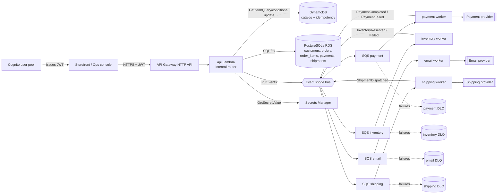

# Architecture

> Living document — updated as each build phase lands. See `docs/adr/` for the
> reasoning behind the big decisions.

## 1. System context

Cloud Commerce is an event-driven commerce & inventory backend on AWS. It
exposes an HTTP API for a storefront and an operations console, persists catalog
data in DynamoDB and transactional order data in PostgreSQL, and processes the
side effects of an order (inventory, payment, email, shipping) asynchronously
through EventBridge + SQS workers.



## 2. Internal code architecture (CLAUDE.md §3)

```
HTTP handler  ──►  Controller  ──►  Application service  ──►  Domain
 (adapter)         (shape I/O)      (use case, ports)         (entities,
                                          │                    value objects,
              ┌───────────────────────────┼───────────────┐    rules)
          Repository            EventPublisher      External provider
        (DynamoDB / PG)         (EventBridge)       (payment / shipping / email)
```

- **Handlers** (`apps/api/src/handlers`, `apps/workers/src/*/handler.ts`) are the
  only files that touch AWS event/response shapes. They build a
  framework-neutral request, run the pipeline, and adapt the response.
- **Controllers** (`apps/api/src/controllers`) parse + validate input (Zod),
  call one application service method, and format the result. No business logic.
- **Application services** implement use cases and depend only on **ports**
  (interfaces, never concrete AWS SDK calls) so they are unit-testable with
  in-memory doubles:
  - HTTP-side: `CatalogService`, `CustomerService`, `OrderService`
    (`packages/domain/<aggregate>/service.ts`).
  - Worker-side: `PaymentProcessor`, `ShipmentProcessor`, `NotificationSender`,
    `InventoryReleaser` (`packages/domain/fulfillment/`).
- **Ports** live in `packages/domain`: repository ports per aggregate,
  `EventPublisher`, `IdempotencyStore`, `MetricsSink`, `Logger`, and the
  external-provider ports (`PaymentProvider` / `ShippingProvider` /
  `EmailProvider`) — moved here in [ADR 006](adr/006-ports-and-fulfillment-module.md).
- **Domain** (`packages/domain/<aggregate>`) is otherwise pure: entities, value
  objects (`Money`), an `Order` state machine, domain errors — no I/O, no
  framework imports.
- **Adapters** live in `packages/database` (DynamoDB + Postgres repos, idempotency
  store, Secrets Manager), `packages/events` (EventBridge publisher, `DlqAdmin`),
  `packages/integrations` (`Mock*` providers), `packages/auth` (Cognito JWT).

> Note: application services are co-located with their aggregate in
> `packages/domain` as a cohesive module (`entity.ts` = pure domain,
> `service.ts` = use cases). They remain framework-free and depend only on
> ports. A separate `packages/application` was considered and rejected as
> ceremony for this size of project.

## 3. Packages

| Package                          | Responsibility                                                               |
| -------------------------------- | ---------------------------------------------------------------------------- |
| `@cloud-commerce/config`         | Typed, validated environment contract. Nothing else reads `process.env`.     |
| `@cloud-commerce/logging`        | Pino structured logging, AsyncLocalStorage correlation context, EMF metrics. |
| `@cloud-commerce/domain`         | Pure domain + application services + ports.                                  |
| `@cloud-commerce/validation`     | Zod boundary schemas + parse helpers.                                        |
| `@cloud-commerce/database`       | DynamoDB repositories, Postgres pool + repositories, Secrets Manager.        |
| `@cloud-commerce/events`         | Domain event envelope, EventBridge publisher, in-memory publisher.           |
| `@cloud-commerce/integrations`   | Payment / shipping / email provider ports + `Mock*` implementations.         |
| `@cloud-commerce/auth`           | Cognito JWT verification, RBAC roles & permissions.                          |
| `@cloud-commerce/api`            | HTTP framework, middleware, routes, controllers, Lambda adapter.             |
| `@cloud-commerce/workers`        | SQS-triggered worker Lambdas.                                                |
| `@cloud-commerce/infrastructure` | AWS CDK app — one stack per concern.                                         |

## 4. Request lifecycle (HTTP)

1. API Gateway invokes the `api` Lambda with an HTTP API v2 event.
2. `handlers/api.ts` builds an `HttpRequest`, generating or reusing an
   `x-correlation-id`, and enters the middleware pipeline.
3. Middleware (outermost first): request-context (ALS scope + start/end logs +
   `LambdaDuration`/`LambdaErrors` metrics) → CORS → error-handler → auth
   (attach `principal`) → rate-limit → route handler.
4. The controller validates input, calls an application service.
5. The service uses ports (repository, event publisher, provider) to do the work
   and returns a domain result or throws a domain error.
6. The error-handler maps domain errors to `application/problem+json`; the
   correlation id is on every response and every log line.

## 5. Data stores (CLAUDE.md §2)

| Store            | Holds                                               | Why                                                              |
| ---------------- | --------------------------------------------------- | ---------------------------------------------------------------- |
| DynamoDB         | catalog + inventory counters, idempotency records   | high-throughput key/known-pattern reads; conditional writes; TTL |
| PostgreSQL / RDS | customers, orders, order_items, payments, shipments | relationships, ACID, ad-hoc operational queries                  |
| S3               | product images, generated reports, log archives     | binary objects only                                              |
| EventBridge      | domain events                                       | producer/consumer decoupling, filtering, replay                  |
| SQS (+DLQ)       | per-worker work queues                              | durable at-least-once delivery, retry, back-pressure             |

## 6. Infrastructure (AWS CDK)

Ten stacks, one concern each, wired in `infrastructure/bin/app.ts`:

| Stack        | Contents                                                                                                                                                          |
| ------------ | ----------------------------------------------------------------------------------------------------------------------------------------------------------------- |
| `Network`    | VPC (2 AZ, **no NAT**), gateway endpoints (S3, DynamoDB), interface endpoints (Secrets Manager, EventBridge, SQS, CloudWatch Logs, cognito-idp), shared Lambda SG |
| `Storage`    | S3 buckets — product images, reports, log archive (private, encrypted, versioned)                                                                                 |
| `Database`   | DynamoDB `catalog` (GSI1 category / GSI2 sku / GSI3 status) + `idempotency` (TTL)                                                                                 |
| `Rds`        | PostgreSQL 16, generated-secret credentials, isolated subnets, scoped SG                                                                                          |
| `Secrets`    | placeholder provider-key secrets (payment, shipping)                                                                                                              |
| `Messaging`  | EventBridge bus + 30-day archive; 4 SQS queues + DLQs; routing rules                                                                                              |
| `Auth`       | Cognito user pool, SPA client, 3 groups, PostConfirmation trigger                                                                                                 |
| `Api`        | one Node 22 Lambda (in the VPC) behind an HTTP API; least-privilege grants                                                                                        |
| `Workers`    | one Lambda per queue, `reportBatchItemFailures`, per-worker grants                                                                                                |
| `Monitoring` | SNS alarm topic, the full alarm set, a CloudWatch dashboard                                                                                                       |

`cdk synth` produces all ten cleanly with `validateAgainstDefaultRules` on.

## 7. Build phases

See `README.md` §Build Status. Each phase shipped code + tests + docs before the
next began.
